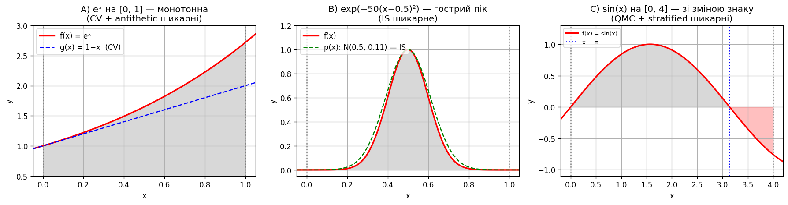

# Завдання 2 (додатково). Розширені методи Монте-Карло

Це продовження `task_02`. Тут порівнюються **6 методів MC-інтегрування** на **3 тестових функціях**, кожна з яких підкреслює сильну сторону певного методу.

## Умова

Показати, що не існує «найкращого» методу Монте-Карло — вибір залежить від **природи функції**. Для цього беремо три функції з принципово різними характеристиками й проганяємо на кожній весь арсенал технік.

| Функція | Інтервал | Тип | Який метод теоретично має сяяти |
|---|---|---|---|
| A) $e^x$ | $[0, 1]$ | монотонна, гладка | **control variate**, antithetic |
| B) $e^{-50(x-0.5)^2}$ | $[0, 1]$ | гострий пік | **importance sampling** |
| C) $\sin x$ | $[0, 4]$ | осцилююча, **міняє знак** | **stratified**, quasi-MC |

## Запуск

```bash
uv run task_02_b/main.py
```

Параметри: `N = 16 384 (= 2¹⁴)`, `seed = 42`. Sobol вимагає степінь двійки.

## Реалізовані методи

1. **Crude MC** (`crude_mc`) — базовий sample-mean, $I \approx (b-a) \cdot \overline{f(X)}$. Еталон для порівняння.
2. **Antithetic variates** (`antithetic_mc`) — пари $(X, a+b-X)$ з від'ємною кореляцією. Допомагає монотонним функціям.
3. **Stratified sampling** (`stratified_mc`) — інтервал ділиться на $k$ страт, у кожній окремий sample-mean. Зменшує дисперсію за рахунок усереднення всередині страт.
4. **Control variate** (`control_variate_mc`) — використовує допоміжну функцію $g$ з відомим інтегралом: $I_f \approx \overline{f - c(g - \bar g)}$, де $c$ підбирається оптимально. Працює, коли є $g$, схожа на $f$.
5. **Importance sampling** (`importance_sampling_mc`) — точки беруться з розподілу $p(x)$, який зосереджений там, де $|f|$ велика, з ваговим коефіцієнтом $f/p$. Магія для «гострих» функцій.
6. **Quasi-MC (Sobol)** (`quasi_mc`) — детерміновані low-discrepancy послідовності замість випадкових. Покриття інтервалу значно рівніше, похибка спадає як $O((\log N)^d / N)$.

**VRF (variance reduction factor)** $= (\sigma_{\text{crude}}/\sigma_{\text{method}})^2$ — у скільки разів дисперсія методу менша за crude MC. `VRF = 10` означає, що метод при $N$ точок дає таку саму точність, як crude MC при $10N$ точок.

## На сьогодні прийнято використовувати

Памʼятка про практичне застосування — де в реальному світі який метод реально працює:

| Метод | Збіжність | Де реально використовується сьогодні | Інструменти |
|---|---|---|---|
| **Crude MC** (sample-mean) | $O(1/\sqrt{N})$ | Майже ніколи в продакшені «в лоб». Базова цеглина, поверх якої будують решту. | numpy |
| **Hit-or-miss** | $O(1/\sqrt{N})$, велика σ | Майже ніколи. Залишився в підручниках як перша історична ілюстрація (Бюффон, ENIAC у Лос-Аламосі, 1947). | — |
| **Antithetic variates** | $O(1/\sqrt{N})$ з меншою σ для монотонних f | Pricing опціонів у фінансах, симуляції траєкторій. Дешева техніка, що дає 2×–3× безкоштовно. | QuantLib, власні impl у банках |
| **Stratified sampling** | $O(1/\sqrt{N})$, помітно менша σ | Computer graphics (антиалізинг у ray tracing), статистика опитувань, MC-інтегрування в наукових симуляціях, чисельне інтегрування багатовимірних задач. | scipy, рендер-двигуни (PBRT, Cycles) |
| **Control variates** | $O(1/\sqrt{N})$, дуже мала σ при доброму g | Фінансовий MC (приклад: для азійських опціонів використовують геометричну опцію як CV — її ціна відома). Bayesian inference, reinforcement learning (baseline у policy gradient). | QuantLib, PyMC |
| **Importance sampling** | $O(1/\sqrt{N})$, сильно менша σ для пікових f | **Rare event simulation**: страхування (катастрофи), надійність (відмови систем), фізика частинок (рідкісні розпади). **ML**: variational inference, off-policy RL, дифузійні моделі. **Статистика**: posterior reweighting. | numpyro, pyro, TensorFlow Probability |
| **Quasi-MC** (Sobol/Halton) | **$O((\log N)^d / N)$** — швидше за √N | **Domінує у computational finance**: ціноутворення деривативів, ризик-моделювання (Basel III). Computer graphics (sampling текстур, BRDF). Дизайн експериментів, sensitivity analysis. | scipy.stats.qmc, Numerical Recipes, MATLAB |
| **Adaptive MC** (VEGAS, MISER) | адаптивно зменшується | Фізика високих енергій (CERN — FeynCalc, MadGraph). Адаптивно «вчиться», де `f` цікава. | VEGAS+ (в HEP), `vegas` Python package |
| **MCMC** (Metropolis, Gibbs, HMC, NUTS) | $O(1/\sqrt{N})$, але семплить складні розподіли | **Король байєсівської статистики**. ML probabilistic models, психологія / медицина (HMC для ієрархічних моделей), статистична фізика, NLP (LDA та сімейство). | **Stan**, **PyMC**, NumPyro, Pyro, JAGS, emcee (astrophysics) |
| **Sequential MC / Particle filters** | залежить | Tracking об'єктів у реальному часі (роботика, GPS, NASA), фінанси (stochastic volatility), bioinformatics. | `particles` (Python), власні impl |

### Швидкий вибір методу за задачею

| Задача | Перший вибір сьогодні |
|---|---|
| Інтеграл одновимірний, гладка f | `scipy.integrate.quad` (НЕ MC), потім QMC |
| Інтеграл багатовимірний (d ≤ 10), гладка | **Quasi-MC (Sobol)** |
| Інтеграл багатовимірний (d > 50) | MCMC або variational methods |
| Ціна опціона | Crude MC + antithetic + control variate, або QMC |
| Симуляція рідкісної події | **Importance sampling** |
| Bayesian inference | **MCMC** (Stan/PyMC) або VI |
| Reinforcement learning (policy gradient) | Importance sampling + control variates |
| Ray tracing / графіка | Stratified + QMC |
| Калібрування фізичної моделі (HEP) | VEGAS / MadGraph |

### Що варто запам'ятати

1. **`scipy.quad` завжди перший вибір** для одновимірних гладких задач. Монте-Карло потрібен лише там, де `quad` не справляється.
2. **Quasi-MC витіснив crude MC** у фінансах за останні 30 років — це фактично новий стандарт для розмірностей до ~10.
3. **MCMC (особливо HMC/NUTS у Stan/PyMC) — золотий стандарт байєсівської статистики** з 2010-х.
4. **Importance sampling — основа сучасного ML**, від variational autoencoders до RLHF (вагування траєкторій).
5. **Сирий crude MC сам по собі не використовують** — завжди комбінують з технікою зменшення дисперсії: antithetic + control variates як мінімум, або повноцінний QMC.

## Графіки функцій



## Результати

Аналітичні значення:

- **A)** $\int_0^1 e^x\,dx = e - 1 \approx 1.71828$
- **B)** $\int_0^1 e^{-50(x-0.5)^2}\,dx = \sqrt{\pi/50}\cdot\text{erf}(0.5\sqrt{50}) \approx 0.25066$
- **C)** $\int_0^4 \sin x\,dx = 1 - \cos 4 \approx 1.65364$

### A) $e^x$ — монотонна, гладка

| Метод | оцінка | abs err | std err | VRF |
| --- | ---:| ---:| ---:| ---:|
| 1. Crude MC | 1.716308 | 0.001974 | 0.003837 | 1.0x |
| 2. Antithetic | 1.718006 | 0.000276 | 0.000689 | **31.0x** |
| 3. Stratified (k=20) | 1.718263 | 0.000018 | 0.000201 | **362.9x** |
| 4. Control variate | 1.718084 | 0.000198 | 0.000489 | **61.5x** |
| 5. Importance sampl. | 1.717604 | 0.000678 | 0.001280 | 9.0x |
| 6. Quasi-MC (Sobol) | 1.718282 | 0.000000 | — | — |

**Переможці**: stratified (363x), control variate (61x), antithetic (31x). QMC дає `|err| ≈ 0` — найкращу точність, хоч формальний VRF неінформативний (формула розрахована на IID-точки).

### B) Гострий пік $e^{-50(x-0.5)^2}$

| Метод | оцінка | abs err | std err | VRF |
| --- | ---:| ---:| ---:| ---:|
| 1. Crude MC | 0.249247 | 0.001415 | 0.002630 | 1.0x |
| 2. Antithetic | 0.251899 | 0.001236 | 0.003748 | **0.5x** ⚠️ |
| 3. Stratified (k=20) | 0.250401 | 0.000262 | 0.000332 | 62.6x |
| 4. Control variate | — | — | — | — (не застосовується) |
| 5. Importance sampl. | 0.250697 | 0.000034 | 0.000245 | **115.3x** ⭐ |
| 6. Quasi-MC (Sobol) | 0.250663 | 0.000000 | — | — |

**Переможець**: importance sampling (115x) — пропозиційний $N(0.5, 0.11)$ повторює форму піка. Stratified теж добре (63x), бо центральні страти ловлять майже всю масу. **Антитетичні погіршили результат** (VRF=0.5x): функція симетрична відносно $x=0.5$, тож $f(X) = f(1-X)$ — пара несе ту саму інформацію.

### C) $\sin x$ на $[0, 4]$ — зі зміною знаку

| Метод | оцінка | abs err | std err | VRF |
| --- | ---:| ---:| ---:| ---:|
| 1. Crude MC | 1.662889 | 0.009245 | 0.016085 | 1.0x |
| 2. Antithetic | 1.660336 | 0.006692 | 0.017877 | 0.8x |
| 3. Stratified (k=20) | 1.652423 | 0.001221 | 0.001350 | **141.9x** ⭐ |
| 4. Control variate | 1.658328 | 0.004684 | 0.012776 | 1.6x |
| 5. Importance sampl. | — | — | — | — (не застосовується для знакомінливих) |
| 6. Quasi-MC (Sobol) | 1.653644 | 0.000000 | — | — |

**Переможці**: stratified (142x) — функція гладка, але має широкий діапазон значень; розбиття на 20 страт «згладжує» дисперсію в кожній. QMC дає машинну точність. **Усі методи коректно обробляють зміну знаку** — на відміну від наївного hit-or-miss у `task_02`.

## Висновки

### 1. Немає універсально «найкращого» методу

VRF для одного й того самого методу різко змінюється від функції до функції:

| Метод | VRF на A | VRF на B | VRF на C |
| --- | ---:| ---:| ---:|
| Antithetic | 31x | **0.5x** | 0.8x |
| Stratified | 363x | 63x | 142x |
| Control variate | 62x | — | 1.6x |
| Importance sampling | 9x | **115x** | — |

Вибір методу — це **проектне рішення під форму функції**, а не «один раз і назавжди».

### 2. Особисті спостереження за методами

- **Antithetic** працює лише для **монотонних або антисиметричних** функцій. Для симетричних (як пік у B) — **погіршує** результат, бо пара точок дублює інформацію.
- **Stratified** — найунiверсальніший: майже завжди дає велике покращення для гладких функцій. Слабкість — вимагає поділу інтервалу та однорідних страт.
- **Control variate** — найефективніший, **коли є відома схожа функція**. Для $e^x$ лінійна $g=1+x$ ідеальна. Для піка чи $\sin$ важко знайти добру $g$.
- **Importance sampling** — **королівський метод для пікових/гострих функцій**. Але потребує знання, де `f` зосереджена, і вміння семплити з пропорційного розподілу. Не працює природньо для функцій, що міняють знак (оптимальний $p \propto |f|$).
- **Quasi-MC** — детермінований, дає машинну точність для гладких функцій. Слабкість — стандартна формула похибки тут неінформативна (точки не IID), для оцінки помилки потрібно багато рандомізацій.

### 3. Stratified — найкращий «дефолт»

З трьох функцій stratified єдиний, що **завжди** дає істотний виграш (від 63x до 363x). Якщо немає особливих знань про форму $f$ — почати варто саме з нього.

### 4. Коли яка техніка

| Тип $f$ | Найкращий вибір |
|---|---|
| Монотонна, близька до лінійної | control variate з лінійною $g$ |
| Симетрична з гострим піком | importance sampling із пропозицією, що повторює пік |
| Осцилююча, гладка | stratified або QMC |
| Багатовимірна (велика $d$) | QMC (до $d \approx 10$) або MCMC |
| Невідомо, експериментуємо | stratified як надійний дефолт |

### 5. Загальний підсумок

На прикладі трьох функцій ми бачимо, що Монте-Карло — це **сімейство методів**, а не один алгоритм. Знання форми функції (монотонність, піки, симетрія, зміна знаку) дозволяє вибрати техніку, яка зменшить кількість необхідних точок у **десятки–сотні разів** при тій самій точності. Особливо це критично для багатовимірних задач, де crude MC стає непридатним.

Хороша стратегія в реальній задачі:
1. **Подивитися на $f$** (графік, аналіз області значень).
2. Якщо є **відома схожа функція** — control variate.
3. Якщо `f` **зосереджена** — importance sampling.
4. Якщо нічого з вищого не очевидне — **stratified + QMC**.
5. Якщо `d` велике й розподіл складний — **MCMC**.

`task_02` показав, що **N не рятує від неправильного методу** (наївний hit-or-miss «застряг» на 21% похибки). Це завдання показує зворотний бік: **правильний метод економить N у десятки разів**.
